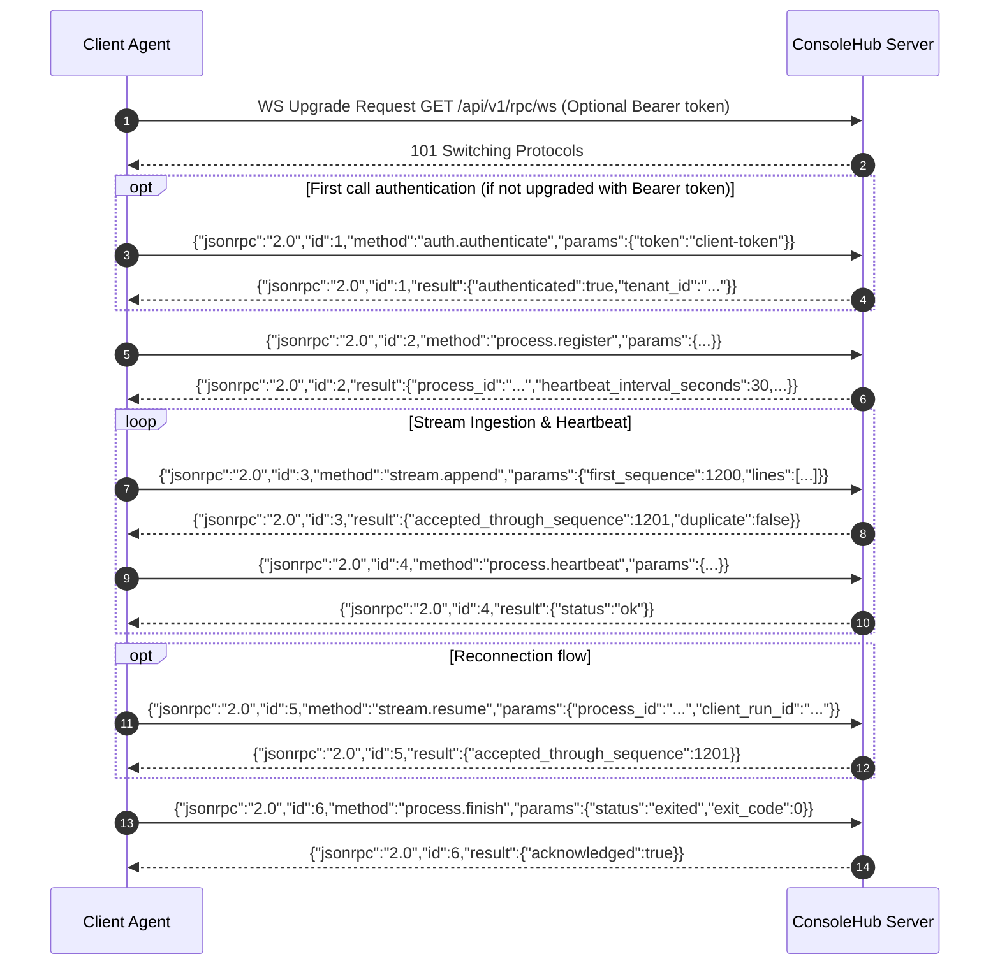

# JSON-RPC 2.0 over WebSockets Ingestion Specification

ConsoleHub uses **JSON-RPC 2.0 over WebSockets** (`GET /api/v1/rpc/ws`) as its primary protocol for real-time telemetry ingestion, heartbeat tracking, and process lifecycle management from client agents.

---

## 1. Overview & Transport Architecture

The WebSocket endpoint acts as a transport adapter over ConsoleHub domain services. No business logic resides directly in the WebSocket handler. The transport converts incoming JSON-RPC 2.0 frames into Go service calls and translates service responses/errors back into standard JSON-RPC 2.0 response objects.

```
+------------------+         WebSocket Frame          +---------------------------+
|  Console Client  | <=============================> | Ingestion WS Adapter      |
|  (App / Agent)   |   JSON-RPC 2.0 Requests/Resps    | (internal/api/jsonrpc)    |
+------------------+                                  +-------------+-------------+
                                                                    |
                                                                    v
                                                      +---------------------------+
                                                      | Ingestion Service         |
                                                      | (internal/services/run)   |
                                                      +---------------------------+
```

---

## 2. Connection Lifecycle



---

## 3. Authentication Methods

Authentication must succeed before any process registration or telemetry calls are accepted. Unauthenticated calls yield error `-32001 (authentication_required)`.

### Method A: HTTP Upgrade Header
Pass `Authorization: Bearer <client-token>` during the initial HTTP WebSocket upgrade handshake (`GET /api/v1/rpc/ws`).

### Method B: `auth.authenticate` Procedure
If HTTP header authentication is omitted, the first message sent over the WebSocket connection **must** be `auth.authenticate`.

#### Request
```json
{
  "jsonrpc": "2.0",
  "id": 1,
  "method": "auth.authenticate",
  "params": {
    "token": "client-token",
    "protocol": {
      "name": "ConsoleHub",
      "version": "1.0"
    }
  }
}
```

#### Response
```json
{
  "jsonrpc": "2.0",
  "id": 1,
  "result": {
    "authenticated": true,
    "tenant_id": "t-84729104",
    "tenant_slug": "production-main"
  }
}
```

---

## 4. Procedure Reference

### `process.register`
Registers an application execution. Utilizes `process.client_run_id` for client-side idempotency.

#### Request
```json
{
  "jsonrpc": "2.0",
  "id": 2,
  "method": "process.register",
  "params": {
    "tenant": "production-main",
    "app": "telegram-replicator",
    "host": {
      "hostname": "vps-01",
      "display_name": "Main VPS",
      "platform": "linux",
      "architecture": "amd64"
    },
    "process": {
      "client_run_id": "e8d71fa9-700d-4a1e-84b2-2a912a76f282",
      "pid": 42817,
      "parent_pid": 1204,
      "started_at": "2026-07-26T17:30:00-05:00",
      "version": "1.4.2",
      "command_line": "./replicator --config config.toml",
      "working_directory": "/srv/replicator"
    },
    "labels": {
      "environment": "production"
    }
  }
}
```

#### Response
```json
{
  "jsonrpc": "2.0",
  "id": 2,
  "result": {
    "process_id": "run-98a72b14-4100",
    "accepted_client_run_id": "e8d71fa9-700d-4a1e-84b2-2a912a76f282",
    "heartbeat_interval_seconds": 30,
    "maximum_batch_lines": 250,
    "maximum_batch_bytes": 262144
  }
}
```

---

### `stream.append`
Appends an ordered batch of log and output lines.

#### Request
```json
{
  "jsonrpc": "2.0",
  "id": 3,
  "method": "stream.append",
  "params": {
    "process_id": "run-98a72b14-4100",
    "batch_id": "c019283f-4100-4b2a-810a-810a019283f4",
    "first_sequence": 1200,
    "lines": [
      {
        "sequence": 1200,
        "timestamp": "2026-07-26T17:30:05.120-05:00",
        "stream": "stdout",
        "kind": "text",
        "text": "Downloading file 42"
      },
      {
        "sequence": 1201,
        "timestamp": "2026-07-26T17:30:05.430-05:00",
        "stream": "log",
        "kind": "json",
        "data": {
          "level": "info",
          "message": "Download progress",
          "percent": 63
        }
      }
    ]
  }
}
```

#### Response
```json
{
  "jsonrpc": "2.0",
  "id": 3,
  "result": {
    "batch_id": "c019283f-4100-4b2a-810a-810a019283f4",
    "accepted_through_sequence": 1201,
    "duplicate": false
  }
}
```

---

### `process.heartbeat`
Periodic process health update.

#### Request
```json
{
  "jsonrpc": "2.0",
  "id": 4,
  "method": "process.heartbeat",
  "params": {
    "process_id": "run-98a72b14-4100",
    "timestamp": "2026-07-26T17:30:30-05:00",
    "last_sent_sequence": 1201,
    "metrics": {
      "buffered_lines": 0
    }
  }
}
```

#### Response
```json
{
  "jsonrpc": "2.0",
  "id": 4,
  "result": {
    "status": "ok"
  }
}
```

---

### `stream.resume`
Queries server state after reconnection to resume streaming from the exact sequence target.

#### Request
```json
{
  "jsonrpc": "2.0",
  "id": 5,
  "method": "stream.resume",
  "params": {
    "process_id": "run-98a72b14-4100",
    "client_run_id": "e8d71fa9-700d-4a1e-84b2-2a912a76f282"
  }
}
```

#### Response
```json
{
  "jsonrpc": "2.0",
  "id": 5,
  "result": {
    "accepted_through_sequence": 1201
  }
}
```

---

### `process.finish`
Marks a process execution as finished.

#### Request
```json
{
  "jsonrpc": "2.0",
  "id": 6,
  "method": "process.finish",
  "params": {
    "process_id": "run-98a72b14-4100",
    "finished_at": "2026-07-26T18:12:44-05:00",
    "status": "exited",
    "exit_code": 0,
    "last_sequence": 8451
  }
}
```

#### Response
```json
{
  "jsonrpc": "2.0",
  "id": 6,
  "result": {
    "acknowledged": true
  }
}
```

---

### Reserved Future Procedures (Remote Control)

The following procedures are reserved for future agent remote control:
- `server.notice` / `server.warning`
- `client.set_log_level` / `client.flush`
- `process.stop` / `process.pause` / `process.resume`

> **Security Note**: Executing process control over WebSockets requires explicit scope authorization and audit logging.

---

## 5. Ordering, Deduplication & Delivery Guarantees

ConsoleHub implements **at-least-once delivery with server-side deduplication**:

1. **`client_run_id`**: Idempotent registration. Re-sending `process.register` with an existing `client_run_id` returns the already created `process_id`.
2. **`batch_id`**: Idempotent batch ingestion. Sending the same `batch_id` twice causes the server to return `accepted_through_sequence` with `"duplicate": true` without inserting duplicate lines.
3. **Monotonic `sequence`**: Sequences start at 1 or specified start offset. Server tracks `accepted_through_sequence`. Gaps return error `-32007 (sequence_gap)`.
4. **Reconnection & Replay**: Upon reconnecting, the client invokes `stream.resume` to read `accepted_through_sequence` and replay only missing sequence items.

---

## 6. Error Codes Reference

| Error Code | Constant Key | Description |
|---|---|---|
| `-32700` | Parse Error | Invalid JSON received by server |
| `-32600` | Invalid Request | JSON-RPC structure invalid |
| `-32601` | Method Not Found | Procedure name not registered |
| `-32602` | Invalid Params | Method parameter payload invalid |
| `-32603` | Internal Error | Unhandled server error |
| `-32001` | `authentication_required` | Connection unauthenticated |
| `-32002` | `permission_denied` | Client lacks tenant access |
| `-32003` | `tenant_not_found` | Specified tenant slug or ID missing |
| `-32004` | `process_not_found` | Invalid `process_id` |
| `-32005` | `process_already_finished` | Operations rejected on closed process |
| `-32006` | `invalid_sequence` | Non-monotonic sequence number |
| `-32007` | `sequence_gap` | Gap detected between expected and received sequence |
| `-32008` | `batch_too_large` | Exceeds max lines (250) or max bytes (256 KB) |
| `-32009` | `rate_limited` | Ingestion quota exceeded |
| `-32010` | `incompatible_protocol_version` | Client protocol version unsupported |

#### Error Payload Example
```json
{
  "jsonrpc": "2.0",
  "id": 3,
  "error": {
    "code": -32007,
    "message": "Sequence gap detected",
    "data": {
      "accepted_through_sequence": 1198,
      "received_first_sequence": 1200
    }
  }
}
```

---

## 7. Operational Limits & Compatibility Rules

* **Maximum Batch Lines**: 250 lines per `stream.append`.
* **Maximum Batch Bytes**: 262,144 bytes (256 KB) per frame.
* **WebSocket Heartbeat / Ping**: WS ping/pong frames every 30 seconds; application level `process.heartbeat` every 30 seconds.
* **Forward Compatibility**: Additional unknown parameters in requests/params must be ignored by server handlers. Unknown JSON-RPC notification fields must not break connection sessions.
